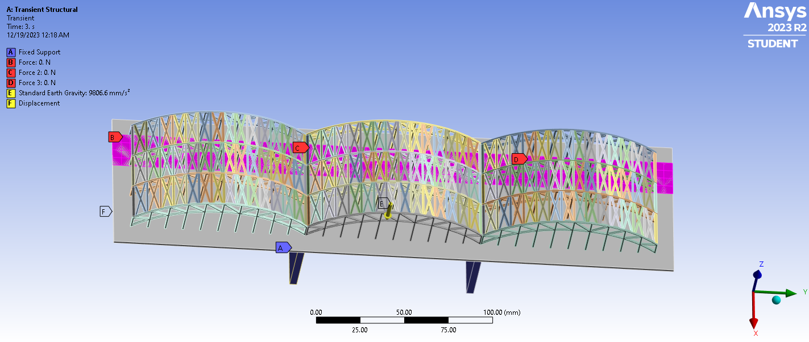

# Structural Health Monitoring of the Hohenzollernbrucke
 
Detection and localisation of structural damage in the Hohenzollernbrucke (Cologne, Germany) using computational intelligence methods applied to finite element simulation data.
 
## Problem
 
The Hohenzollernbrucke is one of the busiest railway bridges in Europe, carrying over 1,200 trains per day across the Rhine. A simplified 3D finite element model of the bridge was created in ANSYS, and transient structural simulations were run under various loading conditions for both healthy and damaged configurations. Damage is introduced by removing structural truss members at five different locations.


 
Given the simulation output (deformations and shear stresses at approximately 29,000 nodes over 11 time steps), the task is to:

1. **Damage Detection:** Classify whether the structure is perfect or imperfect, and if imperfect, identify which of 5 damage locations it belongs to.
2. **Damage Localisation:** Pinpoint the exact nodal region of the structural imperfection.


## Dataset
 
- 4 healthy (perfect) structure cases under different loading conditions
- 15 damaged (imperfect) structure cases: 5 damage locations, each tested under 3 loading conditions
- 1 test case with known ground truth for validation
- Each case contains 7 CSV files: directional deformations (X, Y, Z), total deformation, and shear stresses (XY, XZ, YZ)
- Each CSV contains approximately 29,000 rows (one per FEA node) and 11 columns (one per time step)


The simulation data was generated using ANSYS 2023 R2 (Student Edition) as part of the Computational Intelligence in Engineering course at RWTH Aachen University.

## Approach
 
The problem is framed as a **multi-class classification task with 6 classes**: `perfect`, `imperfect_1`, `imperfect_2`, `imperfect_3`, `imperfect_4`, and `imperfect_5`. The pipeline consists of three stages:
 
**1. Baseline Differencing:**
Each imperfect case is paired with the healthy baseline under the same loading condition. The node-level difference (imperfect response minus perfect response) isolates the damage effect from the loading effect.
 
**2. Statistical Feature Extraction:**
Each difference matrix (approximately 29,000 nodes x 11 time steps) is compressed into 336 statistical features: mean, standard deviation, absolute maximum, and RMS computed globally and at each time step, across all 7 physical quantities.
 
**3. Classification:**
A Random Forest classifier is trained on the 336-feature matrix using Leave-One-Out Cross-Validation (LOOCV) due to the small sample size (19 training cases).
 
## Results
 
| Model | LOOCV Accuracy | Macro AUC |
|-------|:-:|:-:|
| Random Forest (tuned) | 84.21% | 0.98 |
| SVM (tuned) | 78.95% | 0.93 |
 
The tuned Random Forest correctly classifies 16 out of 19 training cases. Three classes achieve perfect AUC scores (1.00): `perfect`, `imperfect_3`, and `imperfect_4`.
 
**Test case limitation:** The held-out test case uses a loading condition (middle track) not present in any imperfect training case. Both models misclassify it. This is a data coverage limitation rather than a model failure. 

**Future:** Alternative approaches including raw features, anomaly detection (inspired by [Hesser et al., 2022](https://doi.org/10.1016/j.ymssp.2021.108298)), and node-level classification are to be investigated in the next phase of this project.
 
## Project Structure
 
```
├── data/                   # Simulation data (not tracked by git)
├── notebooks/
│   ├── 01_data_exploration.ipynb
│   ├── 02_feature_engineering.ipynb
│   ├── 03_classification_random_forest.ipynb
│   ├── 04_classification_svm.ipynb
│   ├── 05_feature_engineering_raw.ipynb
│   └── 06_classification_rf_raw.ipynb
├── docs/                   # Phase documentation (Word files)
├── results/                # Output figures and metrics
├── requirements.txt
├── environment.yml
└── README.md
```

## Setup

```bash
conda create -n shm python=3.11 -y
conda activate shm
pip install -r requirements.txt
```
## References
 
- Hesser, D.F., Altun, K., & Markert, B. (2022). Monitoring and tracking of a suspension railway based on inertial measurements and computational intelligence. *Mechanical Systems and Signal Processing*, 164, 108298.
- Course: Computational Intelligence in Engineering, WS 2023-24, Institute of General Mechanics (IAM), RWTH Aachen University

## Technologies
 
Python 3.11, NumPy, Pandas, Scikit-learn, XGBoost, Matplotlib, Seaborn, Jupyter